# AST-анализ проекта tgbotrusnet

**Дата:** 2026-05-14
**Тип:** Telegram Bot (Node.js/TypeScript)
**Фреймворк:** Telegraf v4
**Платформа:** win32

---

## 1. Общая архитектура

Проект построен по модульной архитектуре с использованием **Composer** (Telegraf) для маршрутизации команд и **tsyringe** для dependency injection.

### 1.1 Диаграммы модулей (по группам)

#### 1.1.1 Точка входа и инфраструктура

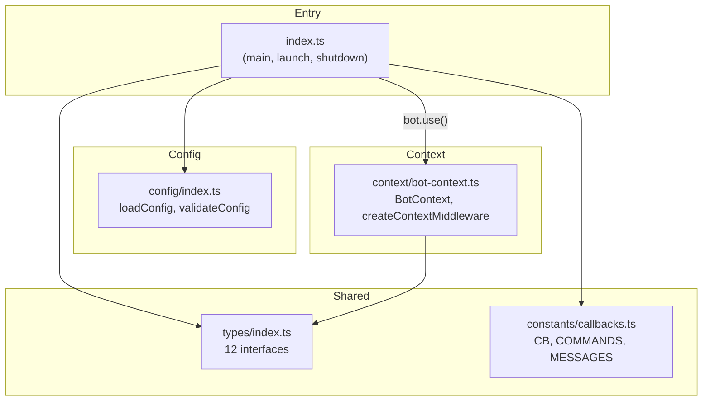

#### 1.1.2 Middleware и маршрутизация

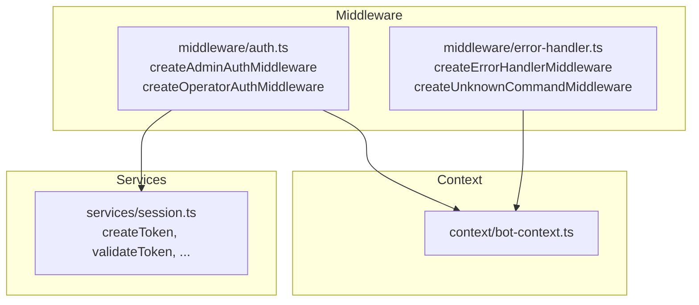

#### 1.1.3 Сервисы и логгирование

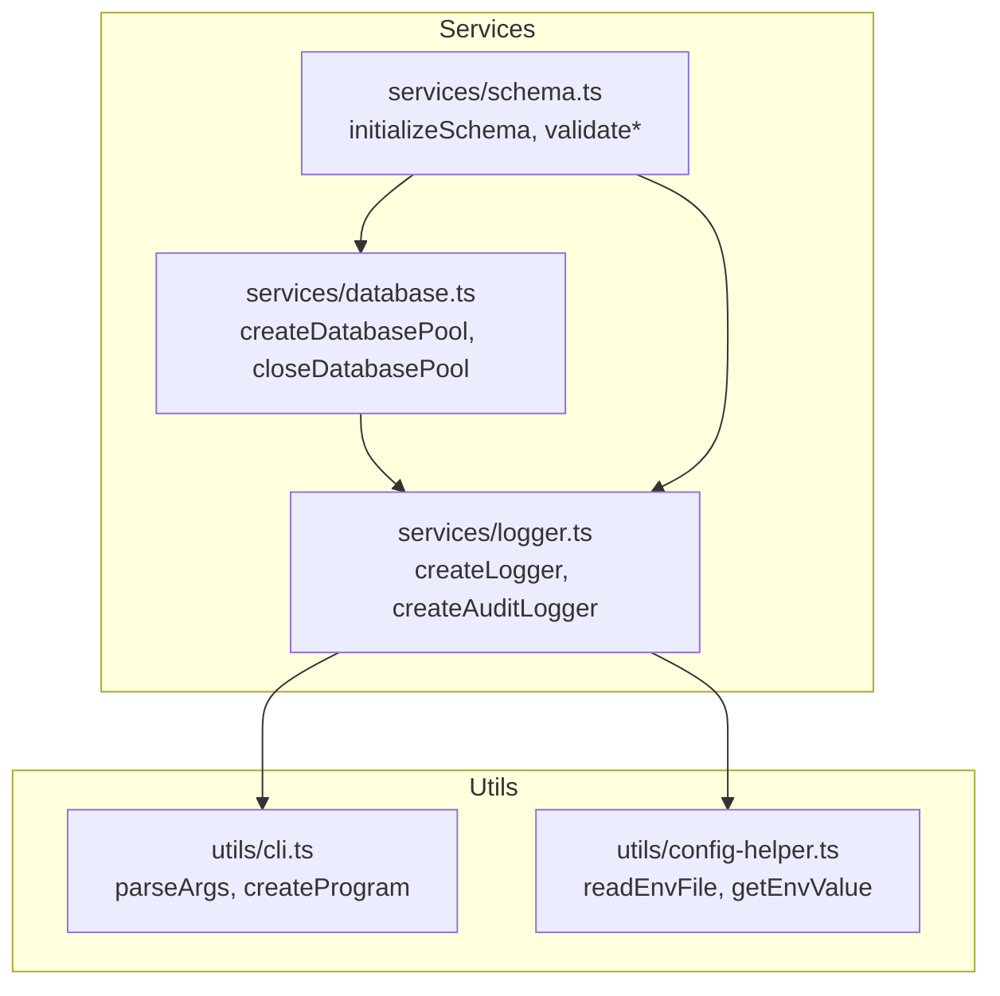

#### 1.1.4 Business-logic сервисы

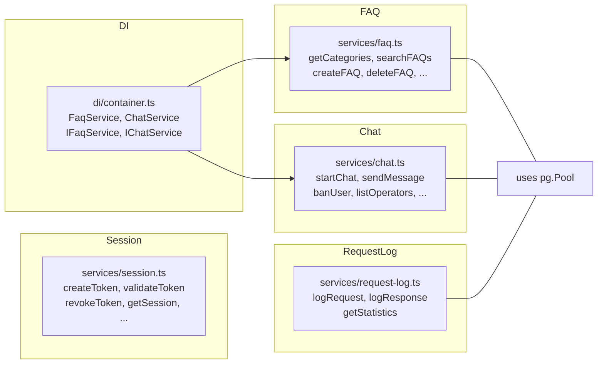

#### 1.1.5 User-обработчики

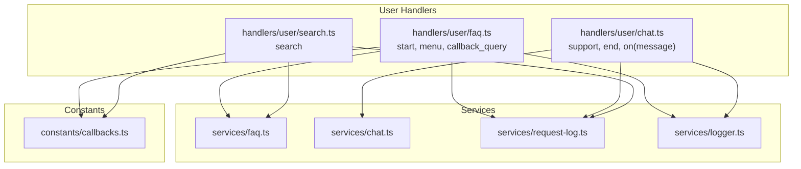

#### 1.1.6 Admin-обработчики

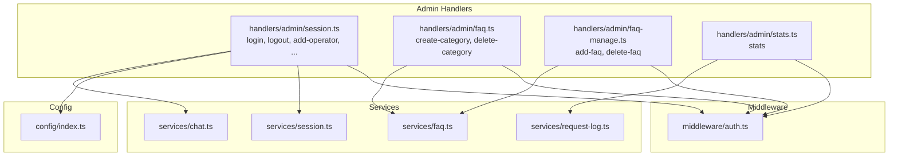

#### 1.1.7 Operator-обработчики

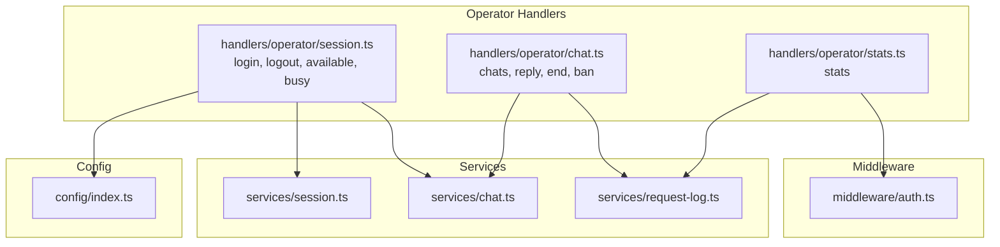

#### 1.1.8 Сцены (WizardScene)

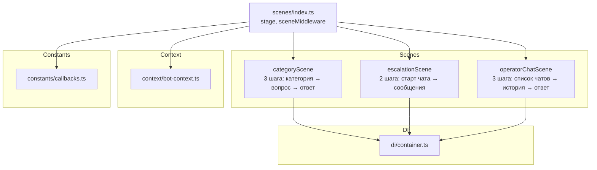

#### 1.1.9 Сводная: иерархия подключения middleware в index.ts

```mermaid
graph LR
    bot["new Telegraf<BotContext>()"]

    subgraph Middleware Pipeline
        direction TB
        M1["1. createContextMiddleware(logger, pool)"]
        M2["2. sceneMiddleware"]
        M3["3. Debug-логгер (verbose)"]
        M4["4. createErrorHandlerMiddleware()"]
        M5["5. createUnknownCommandMiddleware()"]
        M6["6. userFAQ"]
        M7["7. userSearch"]
        M8["8. userChat"]
        M9["9. adminSession"]
        M10["10. adminFAQ"]
        M11["11. adminFAQManage"]
        M12["12. adminStats"]
        M13["13. operatorSession"]
        M14["14. operatorChat"]
        M15["15. operatorStats"]
    end

    bot --> M1 --> M2 --> M3 --> M4 --> M5 --> M6 --> M7 --> M8 --> M9 --> M10 --> M11 --> M12 --> M13 --> M14 --> M15
    bot -->|"/scenes"| scenes_cmd["bot.command('scenes')"]
    bot -->|"enter_*"| scenes_action["bot.action('enter_*')"]

    style M1 fill:#e1f5fe
    style M2 fill:#e1f5fe
    style M4 fill:#fff3e0
    style M5 fill:#fff3e0
    style M6 fill:#e8f5e9
    style M7 fill:#e8f5e9
    style M8 fill:#e8f5e9
    style M9 fill:#fce4ec
    style M10 fill:#fce4ec
    style M11 fill:#fce4ec
    style M12 fill:#fce4ec
    style M13 fill:#f3e5f5
    style M14 fill:#f3e5f5
    style M15 fill:#f3e5f5
```
```

---

## 2. AST-структура: Интерфейсы

### 2.1 `types/index.ts` — Модели данных

| # | Интерфейс | Поля |
|---|-----------|------|
| 1 | `Config` | `botToken: string`, `databaseUrl: string`, `sessionExpiryHours: number`, `adminUserId: string`, `adminPassword: string`, `operatorPassword: string` |
| 2 | `FAQCategory` | `id: number`, `name: string`, `sort_order: number`, `is_default: boolean`, `created_at: Date` |
| 3 | `FAQ` | `id: number`, `category_id: number`, `question: string`, `answer: string`, `created_at: Date` |
| 4 | `Operator` | `id: number`, `user_id: number`, `password_hash: string`, `is_active: boolean`, `created_at: Date` |
| 5 | `Admin` | `id: number`, `user_id: number`, `password_hash: string`, `created_at: Date` |
| 6 | `Chat` | `id: number`, `user_id: number`, `operator_id: number \| null`, `status: "waiting" \| "active" \| "closed"`, `category: string \| null`, `started_at: Date`, `ended_at: Date \| null` |
| 7 | `ChatMessage` | `id: number`, `chat_id: number`, `sender_type: "user" \| "operator" \| "system"`, `text: string`, `created_at: Date` |
| 8 | `BannedUser` | `id: number`, `user_id: number`, `reason: string`, `banned_at: Date` |
| 9 | `RequestLog` | `id: number`, `user_id: number`, `text: string`, `category: string \| null`, `result_type: "auto_response" \| "escalation" \| "error"`, `response_time_ms: number`, `created_at: Date` |
| 10 | `Session` | `token: string`, `type: "admin" \| "operator"`, `user_id: number`, `expires_at: Date` |
| 11 | `ChatContext` | `chat: Chat`, `messages: ChatMessage[]`, `user_id: number`, `category: string \| null` |
| 12 | `RequestStatistics` | `total: number`, `auto_responses: number`, `escalations: number`, `average_response_time_ms: number`, `period_start: Date`, `period_end: Date` |

### 2.2 `context/bot-context.ts`

```typescript
interface BotContext extends Context {
  logger: Logger;
  db: DatabasePool;
  session?: { type: 'admin' | 'operator'; userId: number; token: string };
  activeChat?: { chatId: number; operatorId: number | null; status: 'waiting' | 'active' | 'closed' };
}
```

### 2.3 `di/container.ts`

```typescript
interface IFaqService {
  getCategories(pool: DatabasePool): Promise<Array<{ id: number; name: string }>>;
  getQuestionsByCategory(pool: DatabasePool, categoryId: number): Promise<Array<{ id: number; question: string }>>;
  getFAQById(pool: DatabasePool, faqId: number): Promise<{ id: number; question: string; answer: string } | null>;
}

interface IChatService {
  startChat(pool: DatabasePool, userId: number, category: string | null): Promise<{ id: number; user_id: number }>;
  getActiveChats(pool: DatabasePool): Promise<Array<{ id: number; user_id: number }>>;
  getActiveChatsForOperator(pool: DatabasePool, operatorId: number): Promise<Array<{ id: number; user_id: number }>>;
  assignOperatorToChat(pool: DatabasePool, chatId: number, operatorId: number): Promise<{ id: number } | null>;
  sendMessage(pool: DatabasePool, chatId: number, senderType: 'user' | 'operator' | 'system', text: string): Promise<{ id: number }>;
  getChatHistory(pool: DatabasePool, chatId: number): Promise<Array<{ id: number; sender_type: string; text: string }>>;
  endChat(pool: DatabasePool, chatId: number): Promise<{ id: number } | null>;
  isUserBanned(pool: DatabasePool, userId: number): Promise<boolean>;
  getAvailableOperators(pool: DatabasePool): Promise<Array<{ id: number; user_id: number }>>;
}
```

### 2.4 `services/request-log.ts`

```typescript
interface PendingRequest {
  user_id: number;
  text: string;
  category: string | null;
  started_at: Date;
}
```

### 2.5 `services/schema.ts`

```typescript
interface ValidationResult {
  valid: boolean;
  errors: string[];
}
```

### 2.6 `utils/cli.ts`

```typescript
interface CLIArgs {
  host: string;
  port: number;
  logPath: string | false;
  logPretty: boolean;
  help: boolean;
  verbose: boolean;
}

interface EnvConfig {
  [key: string]: string | undefined;
}

interface ParsedConnectionString {
  user: string;
  password: string;
  host: string;
  port: string;
  database: string;
}
```

### 2.7 `utils/config-helper.ts`

```typescript
interface EnvConfig {
  [key: string]: string | undefined;
}
```

---

## 3. AST-структура: Типы (type aliases)

| Файл | Type Alias | Значение |
|------|-----------|----------|
| `services/database.ts` | `DatabasePool` | `pg.Pool` |
| `services/logger.ts` | `Logger` | `pino.Logger` |

---

## 4. AST-структура: Классы

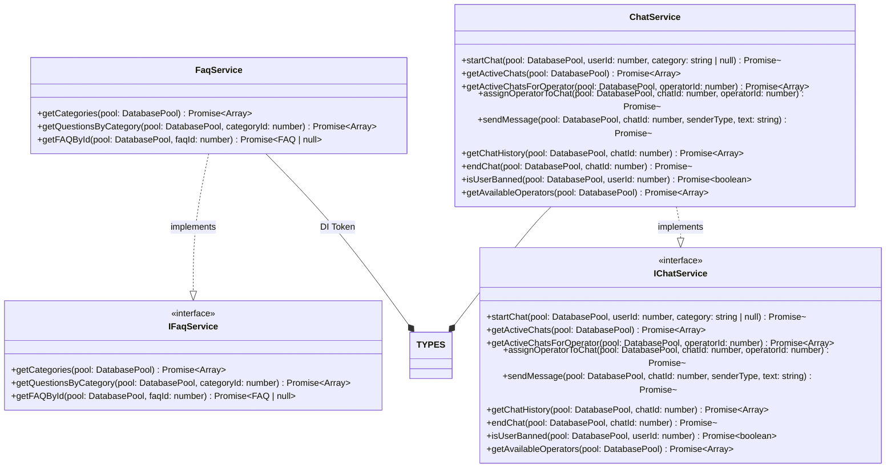

### 4.1 DI-декораторы

Оба класса используют декораторы tsyringe:
- `@injectable()` — регистрирует класс в DI-контейнере
- `@singleton()` — гарантирует единственный экземпляр

---

## 5. AST-структура: Функции

### 5.1 Экспортируемые async функции

| Файл | Функция | Назначение |
|------|---------|------------|
| `config/index.ts` | `loadConfig()` : `Config` | Загрузка конфигурации из env |
| `config/index.ts` | `validateConfig(config)` | Валидация конфигурации |
| `context/bot-context.ts` | `createContextMiddleware(logger, db)` : `MiddlewareFn` | Middleware контекста бота |
| `services/database.ts` | `createDatabasePool(logger)` : `DatabasePool` | Создание пула соединений |
| `services/database.ts` | `closeDatabasePool(pool, logger)` : `Promise<void>` | Закрытие пула |
| `services/logger.ts` | `createLogger(config)` : `Promise<Logger>` | Создание логгера |
| `services/logger.ts` | `createAuditLogger()` : `any` | Аудит-логгер (singleton) |
| `services/logger.ts` | `logUserAction(action, userId, metadata?)` | Логирование действий |
| `services/session.ts` | `createToken(type, userId, expiryHours?)` : `string` | Создание токена |
| `services/session.ts` | `validateToken(token)` : `Session \| null` | Валидация токена |
| `services/session.ts` | `revokeToken(token)` : `boolean` | Отзыв токена |
| `services/session.ts` | `revokeAllTokens()` : `void` | Очистка всех сессий |
| `services/session.ts` | `getActiveSessions()` : `Session[]` | Активные сессии |
| `services/session.ts` | `getSession(userId)` : `Session \| null` | Сессия по userId |
| `services/session.ts` | `createSession(userId, type, data?)` : `Session` | Создание сессии |
| `services/session.ts` | `updateSession(userId, updates)` : `Session \| null` | Обновление сессии |
| `services/session.ts` | `deleteSession(userId)` : `boolean` | Удаление сессии |
| `services/faq.ts` | `getCategories(pool)` : `Promise<FAQCategory[]>` | Все категории |
| `services/faq.ts` | `getQuestionsByCategory(pool, categoryId)` : `Promise<FAQ[]>` | FAQ по категории |
| `services/faq.ts` | `searchFAQs(pool, keyword)` : `Promise<FAQ[]>` | Поиск по FAQ |
| `services/faq.ts` | `createCategory(pool, name, sortOrder?)` : `Promise<FAQCategory>` | Создание категории |
| `services/faq.ts` | `createFAQ(pool, categoryId, question, answer)` : `Promise<FAQ>` | Создание FAQ |
| `services/faq.ts` | `deleteCategory(pool, categoryId)` : `Promise<boolean>` | Удаление категории |
| `services/faq.ts` | `deleteFAQ(pool, faqId)` : `Promise<boolean>` | Удаление FAQ |
| `services/faq.ts` | `getFAQById(pool, faqId)` : `Promise<FAQ \| null>` | FAQ по ID |
| `services/faq.ts` | `searchFaqs(pool, keyword)` : `Promise<FAQ[]>` | Алиас searchFAQs |
| `services/chat.ts` | `startChat(pool, userId, category?)` : `Promise<Chat>` | Старт чата |
| `services/chat.ts` | `getActiveChats(pool)` : `Promise<Chat[]>` | Активные чаты |
| `services/chat.ts` | `getActiveChatsForOperator(pool, operatorId)` : `Promise<Chat[]>` | Чаты оператора |
| `services/chat.ts` | `assignOperatorToChat(pool, chatId, operatorId)` : `Promise<Chat \| null>` | Назначение оператора |
| `services/chat.ts` | `sendMessage(pool, chatId, senderType, text)` : `Promise<ChatMessage>` | Отправка сообщения |
| `services/chat.ts` | `getChatHistory(pool, chatId)` : `Promise<ChatMessage[]>` | История чата |
| `services/chat.ts` | `endChat(pool, chatId)` : `Promise<Chat \| null>` | Завершение чата |
| `services/chat.ts` | `banUser(pool, userId, reason)` : `Promise<boolean>` | Блокировка пользователя |
| `services/chat.ts` | `isUserBanned(pool, userId)` : `Promise<boolean>` | Проверка блокировки |
| `services/chat.ts` | `getAvailableOperators(pool)` : `Promise<Operator[]>` | Доступные операторы |
| `services/chat.ts` | `setOperatorStatus(pool, operatorId, isActive)` : `Promise<void>` | Статус оператора |
| `services/chat.ts` | `getChatById(pool, chatId)` : `Promise<Chat \| null>` | Чат по ID |
| `services/chat.ts` | `addOperator(pool, userId, passwordHash)` : `Promise<boolean>` | Добавление оператора |
| `services/chat.ts` | `removeOperator(pool, userId)` : `Promise<boolean>` | Удаление оператора |
| `services/chat.ts` | `listOperators(pool)` : `Promise<Operator[]>` | Список операторов |
| `services/chat.ts` | `addAdmin(pool, userId, passwordHash)` : `Promise<boolean>` | Добавление админа |
| `services/chat.ts` | `getChatsByUser(pool, userId)` : `Promise<Chat[]>` | Чаты пользователя |
| `services/chat.ts` | `updateChat(pool, chatId, updates)` : `Promise<Chat \| null>` | Обновление чата |
| `services/request-log.ts` | `logRequest(pool, userId, message, handler, logger)` : `Promise<void>` | Логирование запроса |
| `services/request-log.ts` | `logResponse(pool, userId, resultType, logger)` : `Promise<void>` | Логирование ответа |
| `services/request-log.ts` | `getStatistics(pool, days?)` : `Promise<RequestStatistics>` | Статистика |
| `services/schema.ts` | `initializeSchema(pool, logger)` : `Promise<void>` | Инициализация БД |
| `services/schema.ts` | `validateUserData(data)` : `ValidationResult` | Валидация пользователя |
| `services/schema.ts` | `validateChatData(data)` : `ValidationResult` | Валидация чата |
| `services/schema.ts` | `validateFaqData(data)` : `ValidationResult` | Валидация FAQ |
| `middleware/auth.ts` | `createAdminAuthMiddleware()` : `MiddlewareFn` | Admin auth middleware |
| `middleware/auth.ts` | `createOperatorAuthMiddleware()` : `MiddlewareFn` | Operator auth middleware |
| `middleware/error-handler.ts` | `createErrorHandlerMiddleware()` : `MiddlewareFn` | Error handler middleware |
| `middleware/error-handler.ts` | `createUnknownCommandMiddleware()` : `MiddlewareFn` | Unknown command middleware |
| `utils/cli.ts` | `parseArgs(args?)` : `CLIArgs` | Парсинг аргументов |
| `utils/cli.ts` | `createProgram()` : `Command` | CLI программа |
| `utils/config-helper.ts` | `readEnvFile()` : `EnvConfig` | Чтение .env |
| `utils/config-helper.ts` | `writeEnvFile(config)` | Запись .env |
| `utils/config-helper.ts` | `getEnvValue(key)` : `string \| undefined` | Значение из .env |
| `utils/config-helper.ts` | `setEnvValue(key, value)` | Установка значения в .env |
| `utils/config-helper.ts` | `setMultipleEnvValues(values)` | Множественная установка |
| `utils/config-helper.ts` | `envFileExists()` : `boolean` | Проверка .env |
| `utils/config-helper.ts` | `createEnvFile()` | Создание .env |
| `utils/guards.ts` | `hasCallbackData(ctx)` : type guard | Проверка callback data |
| `utils/guards.ts` | `hasTextMessage(ctx)` : type guard | Проверка текстового сообщения |
| `utils/guards.ts` | `getUserId(ctx)` : `number \| undefined` | ID пользователя |
| `utils/guards.ts` | `getUserIdOrThrow(ctx)` : `number` | ID пользователя с ошибкой |
| `utils/guards.ts` | `getChatIdFromCallback(data, prefix)` : `number \| null` | ID чата из callback |
| `index.ts` | `main(args)` : `Promise<void>` | Главная функция бота |

### 5.2 Приватные/внутренние функции

| Файл | Функция | Назначение |
|------|---------|------------|
| `services/logger.ts` | `ensureLogDir(logFilePath)` | Создание директории логов |
| `services/logger.ts` | `getLogSettings(config)` | Настройки логирования |
| `services/logger.ts` | `createPrettyStream()` | Pretty-print stream |
| `utils/cli.ts` | `readEnvFile()` : `EnvConfig` | Чтение .env файла |
| `utils/cli.ts` | `writeEnvFile(config)` | Запись .env файла |
| `utils/cli.ts` | `getEnvValue(key)` | Получение env значения |
| `utils/cli.ts` | `setEnvValue(key, value)` | Установка env значения |
| `utils/cli.ts` | `parseConnectionString(url)` : `ParsedConnectionString` | Парсинг строки подключения |
| `utils/cli.ts` | `testDbConnection()` | Тест подключения к БД |
| `utils/cli.ts` | `initializeDatabase(schemaFile?, force?, dbName?)` | Инициализация БД |
| `utils/cli.ts` | `showLogConfig()` | Показать конфиг логов |
| `utils/cli.ts` | `interactiveLogConfig()` | Интерактивная настройка логов |
| `utils/cli.ts` | `simpleHash(str)` : `string` | Хеширование пароля |
| `utils/cli.ts` | `createAdmin(telegramId?, password?)` | Создание админа |
| `handlers/admin/session.ts` | `simpleHash(str)` : `string` | Хеширование пароля |

---

## 6. AST-структура: Константы

### 6.1 `constants/callbacks.ts`

```typescript
export const CB = {
  CAT: 'cat_',
  FAQ: 'faq_',
  CHAT: 'chat_',
  MENU: 'menu',
  SCENE_CAT: 'scene_cat_',
  SCENE_FAQ: 'scene_faq_',
  SCENE_MENU: 'scene_menu',
  OP_CHAT: 'op_chat_',
} as const;

export const COMMANDS = {
  SUPPORT: 'support',
  END: 'end',
  MENU: 'menu',
} as const;

export const MESSAGES = {
  NO_ACTIVE_CHAT: '...',
  USER_BANNED: '...',
  NO_OPERATORS: '...',
  CHAT_ENDED: '...',
  ERROR_GENERIC: '...',
} as const;
```

### 6.2 `di/container.ts`

```typescript
export const TYPES = {
  DatabasePool: Symbol('DatabasePool'),
  Logger: Symbol('Logger'),
  FaqService: Symbol('FaqService'),
  ChatService: Symbol('ChatService'),
};
export const FaqServiceToken = TYPES.FaqService;
export const ChatServiceToken = TYPES.ChatService;
```

### 6.3 `utils/cli.ts`

```typescript
const DEFAULTS: CLIArgs = {
  host: '0.0.0.0',
  port: 3000,
  logPath: false,
  logPretty: true,
  help: false,
  verbose: false,
};
const ENV_FILE = '.env';
```

### 6.4 `utils/config-helper.ts`

```typescript
const ENV_FILE = '.env';
```

### 6.5 `index.ts` — Глобальные переменные

```typescript
let logger: pino.Logger;
let pool: DatabasePool;
let bot: Telegraf<BotContext>;
```

---

## 7. AST-структура: Обработчики (Composer)

Все обработчики используют паттерн `Composer<BotContext>` от Telegraf.

### 7.1 User handlers

| Composer | Файл | Команды |
|----------|------|---------|
| `userComposer` | `handlers/user/faq.ts` | `/start`, `/menu`, `callback_query` (категории, FAQ) |
| `userComposer` | `handlers/user/search.ts` | `/search` |
| `userComposer` | `handlers/user/chat.ts` | `/support`, `/end`, `on("message")` |

### 7.2 Admin handlers

| Composer | Файл | Команды | Middleware |
|----------|------|---------|-----------|
| `adminComposer` | `handlers/admin/session.ts` | `/admin login`, `/admin logout`, `/admin add-operator`, `/admin remove-operator`, `/admin list-operators` | `createAdminAuthMiddleware()` |
| `adminComposer` | `handlers/admin/faq.ts` | `/admin create-category`, `/admin delete-category` | `createAdminAuthMiddleware()` (через `use`) |
| `adminComposer` | `handlers/admin/faq-manage.ts` | `/admin add-faq`, `/admin delete-faq` | `createAdminAuthMiddleware()` (через `use`) |
| `adminComposer` | `handlers/admin/stats.ts` | `/admin stats` | `createAdminAuthMiddleware()` (через `use`) |

### 7.3 Operator handlers

| Composer | Файл | Команды |
|----------|------|---------|
| `operatorComposer` | `handlers/operator/session.ts` | `/operator login`, `/operator logout`, `/operator available`, `/operator busy` |
| `operatorComposer` | `handlers/operator/chat.ts` | `/operator chats`, `/operator reply`, `/operator end`, `/operator ban` |
| `operatorComposer` | `handlers/operator/stats.ts` | `/operator stats` |

---

## 8. AST-структура: Сцены (WizardScene)

Файл: `scenes/index.ts`

### 8.1 `categoryScene` (WizardScene — 3 шага)

| Шаг | Действие |
|-----|----------|
| 1 | Показ категорий FAQ |
| 2 | Выбор категории → показ вопросов |
| 3 | Выбор вопроса → показ ответа |

### 8.2 `escalationScene` (WizardScene — 2 шага)

| Шаг | Действие |
|-----|----------|
| 1 | Проверка бана, назначение оператора, старт чата |
| 2 | Прием сообщений от пользователя |

Команда `/end` — завершение чата (через `escalationScene.command`).

### 8.3 `operatorChatScene` (WizardScene — 3 шага)

| Шаг | Действие |
|-----|----------|
| 1 | Показ активных чатов |
| 2 | Выбор чата → показ истории |
| 3 | Прием сообщений от оператора |

Action `op_close` — завершение чата.

---

## 9. AST-структура: Middleware

### 9.1 `middleware/auth.ts`

- `createAdminAuthMiddleware()` — проверяет наличие и валидность admin-токена в `ctx.session`
- `createOperatorAuthMiddleware()` — проверяет наличие и валидность operator-токена в `ctx.session`

### 9.2 `middleware/error-handler.ts`

- `createErrorHandlerMiddleware()` — глобальный try-catch с классификацией ошибок: `ETELEGRAM`, `ECONNREFUSED`, generic
- `createUnknownCommandMiddleware()` — проверяет неизвестные команды (`/...`) и выводит сообщение

---

## 10. Граф зависимостей между модулями

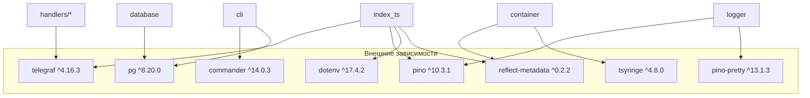

### 10.1 Импортируемые npm-пакеты

| Пакет | Используется в | Версия |
|-------|---------------|--------|
| `telegraf` | index.ts, context/, middleware/, handlers/, scenes/ | ^4.16.3 |
| `pg` | services/database.ts, services/faq.ts, services/chat.ts, services/schema.ts, services/request-log.ts, utils/cli.ts | ^8.20.0 |
| `pino` | services/logger.ts, index.ts | ^10.3.1 |
| `pino-pretty` | services/logger.ts | ^13.1.3 |
| `tsyringe` | di/container.ts | ^4.8.0 |
| `commander` | utils/cli.ts | ^14.0.3 |
| `dotenv` | index.ts | ^17.4.2 |
| `reflect-metadata` | index.ts, di/container.ts | ^0.2.2 |

---

## 11. Структура in-memory хранилищ

| Модуль | Структура | Назначение |
|--------|-----------|------------|
| `services/session.ts` | `Map<string, Session>` (const) | Хранение сессий по токену |
| `services/request-log.ts` | `Map<number, PendingRequest>` (const) | Ожидающие ответа запросы |

---

## 12. Схема БД (из `services/schema.ts`)

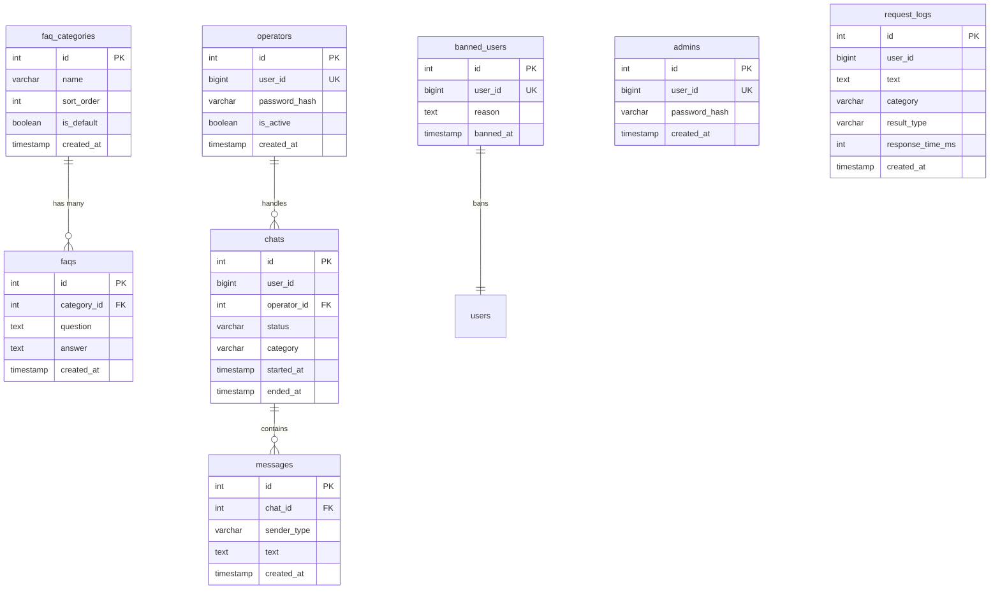

---

## 13. AST-информация: Ключевые узлы

### 13.1 `index.ts` — Точка входа (AST-корень)

```
Program
├── ImportDeclaration × 22 строк импорта
├── VariableDeclaration (let logger: pino.Logger)
├── VariableDeclaration (let pool: DatabasePool)
├── VariableDeclaration (let bot: Telegraf<BotContext>)
├── FunctionDeclaration: main(args: CLIArgs) → Promise<void>
│   ├── IfStatement (args.help → createProgram().help())
│   ├── ExpressionStatement (logger = await createLogger(args))
│   ├── ExpressionStatement (const config = loadConfig())
│   ├── ExpressionStatement (validateConfig(config))
│   ├── ExpressionStatement (pool = createDatabasePool(logger))
│   ├── ExpressionStatement (await initializeSchema(pool, logger))
│   ├── ExpressionStatement (bot = new Telegraf<BotContext>(...))
│   ├── CallExpression × 15 (bot.use(...), bot.command(...), bot.action(...))
│   ├── ArrowFunction × 2 (signal handlers)
│   ├── CallExpression (bot.launch(...))
│   └── ReturnStatement (logger.info(...))
├── VariableDeclaration (const args = parseArgs())
└── ExpressionStatement (main(args).catch(...))
```

### 13.2 `di/container.ts` — DI-контейнер (AST-корень)

```
Program
├── ImportDeclaration × 3
├── VariableDeclaration: export const TYPES = { ... }
├── InterfaceDeclaration: IFaqService
├── InterfaceDeclaration: IChatService
├── ClassDeclaration: FaqService implements IFaqService
│   ├── Decorator: @injectable()
│   ├── Decorator: @singleton()
│   └── MethodDefinition × 3 (getCategories, getQuestionsByCategory, getFAQById)
├── ClassDeclaration: ChatService implements IChatService
│   ├── Decorator: @injectable()
│   ├── Decorator: @singleton()
│   └── MethodDefinition × 9 (startChat, getActiveChats, ..., getAvailableOperators)
└── VariableDeclaration: export const FaqServiceToken, ChatServiceToken
```

### 13.3 `scenes/index.ts` — Сцены (AST-корень)

```
Program
├── Comment (eslint-disable)
├── ImportDeclaration × 6
├── VariableDeclaration: faqService = new FaqService()
├── VariableDeclaration: chatService = new ChatService()
├── VariableDeclaration: categoryScene = new WizardScene(...)  (3 шага)
├── ExpressionStatement: categoryScene.leave(...)
├── VariableDeclaration: escalationScene = new WizardScene(...)  (2 шага)
├── ExpressionStatement: escalationScene.command('end', ...)
├── VariableDeclaration: operatorChatScene = new WizardScene(...)  (3 шага)
├── ExpressionStatement: operatorChatScene.action('op_close', ...)
├── VariableDeclaration: stage = new Stage([...])
├── VariableDeclaration: sceneMiddleware = stage.middleware()
└── ExportNamedDeclaration: { stage, Scenes, sceneMiddleware }
```

---

## 14. Метрики проекта

| Метрика | Значение |
|---------|----------|
| TypeScript файлов (src/) | 39 |
| Интерфейсов | 18 |
| Type aliases | 2 |
| Классов | 2 |
| Экспортируемых функций | 60+ |
| Внутренних функций | 15 |
| Composer-обработчиков | 10 |
| WizardScene | 3 |
| Middleware-функций | 4 |
| Внешних зависимостей | 9 |
| Хранилищ in-memory | 2 |
| Таблиц БД | 7 |
